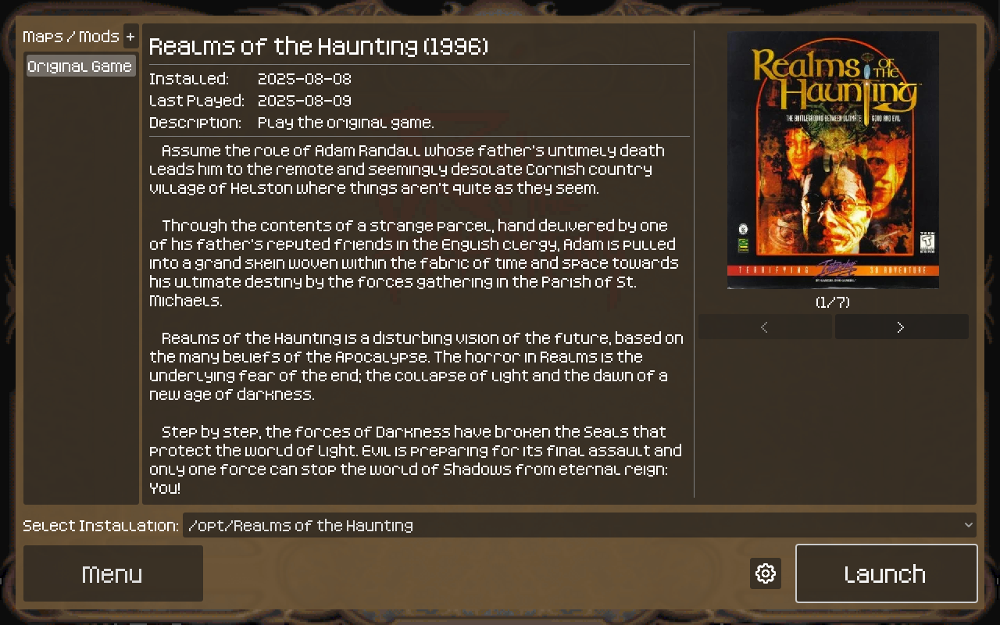
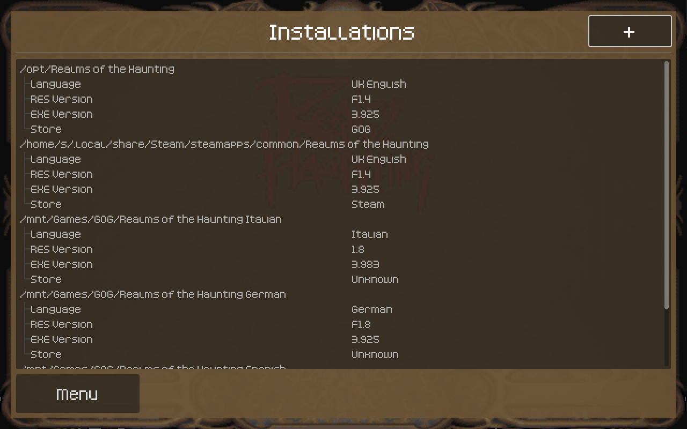
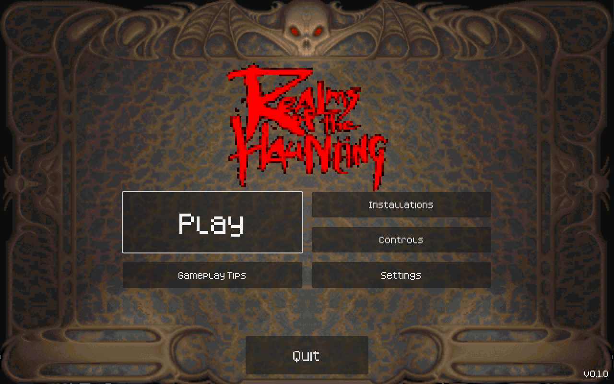
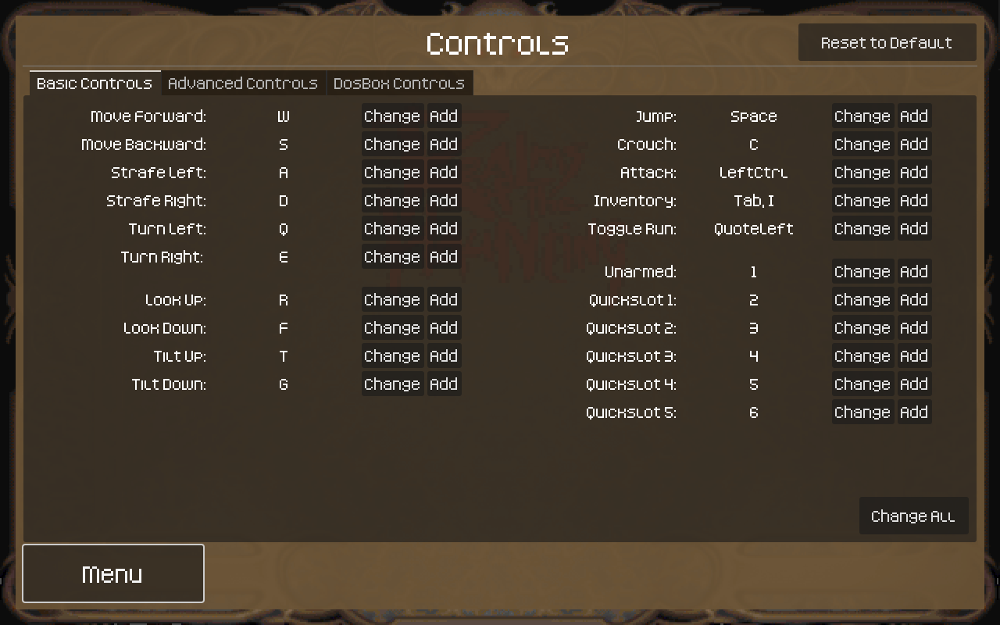
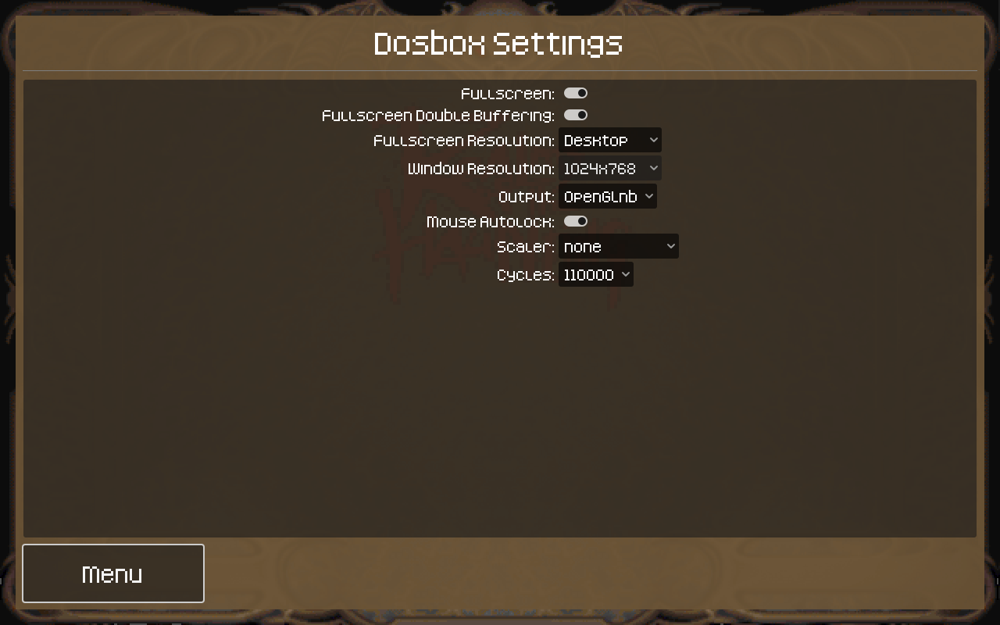
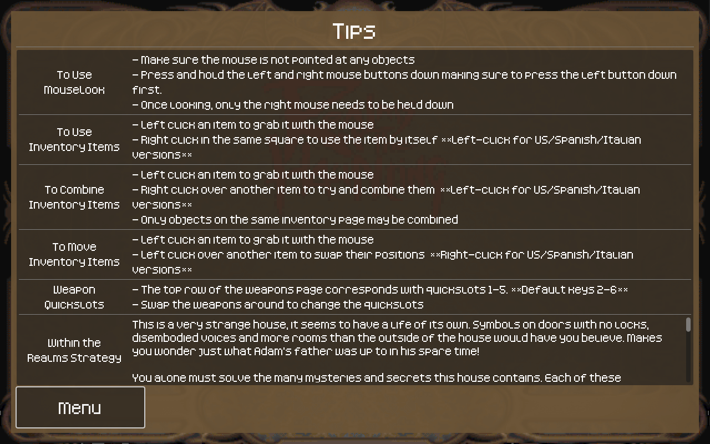
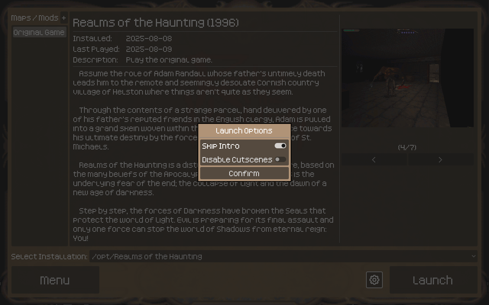

# RotH Launcher

## Introduction
RotH Launcher allows for the easy configuration and key rebinding of the 1996 DOS game Realms of the Haunting. In the future it will also facilitate the launching of custom maps made with the [RotH Editor](https://github.com/slidick/roth-editor)

## Getting Started
Download the latest [release](https://github.com/slidick/roth-launcher/releases) for your platform. Extract to a location of your choosing and run the executable. On first launch you will be greeted with a screen to choose your installation directory. If your Realms of the Haunting installation is in a default location for Steam or GOG it should be detected automatically, otherwise add your installation by clicking the plus in the top right. After a location is selected, press Menu to go to the main menu.

## Controls
Here you can rebind the keys for the game. Multiple keys can be bound to the same action. Warning: Conflicts are not checked for, so be sure not to bind the same key to multiple actions!

## Settings
Here you can change the settings used by dosbox. Optimal settings are selected by default. Cycles option is provided for speedrunners.

## Tips
Here you can find tips on some commonly misunderstood features of the game.

## Play
The play screen is where you can add and select the map pack you'd like to play (only the original game is available for now). Advanced users can find a couple additional launch options when clicking the gear icon. After launching the game, please keep the launcher open as it does make some modifications that get reverted once the game closes.

## Feedback
Please provide feedback / bug reports via the [issue tracker](https://github.com/slidick/roth-launcher/issues) or post on the [Realms of the Haunting Discord #modding channel](https://discord.com/invite/v4YVN4e).

